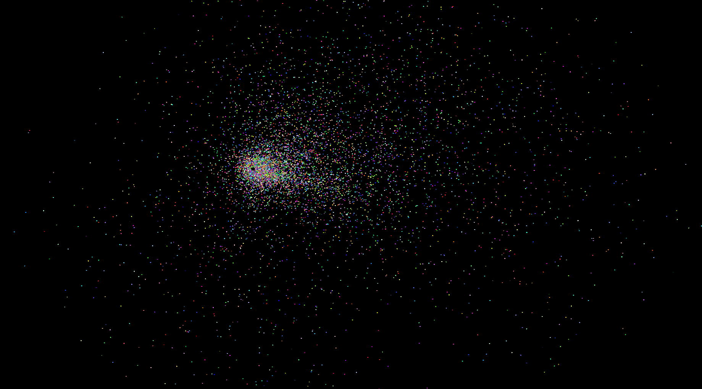
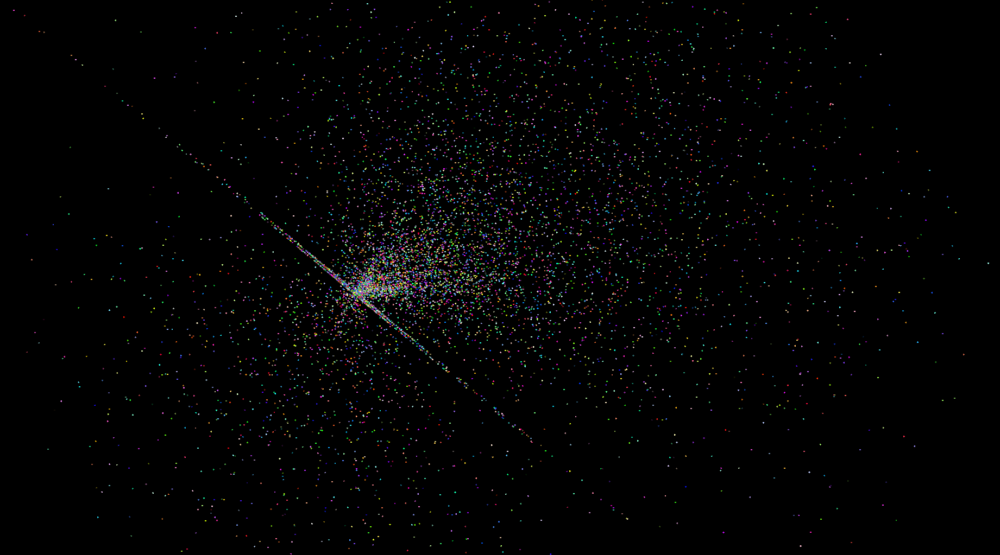
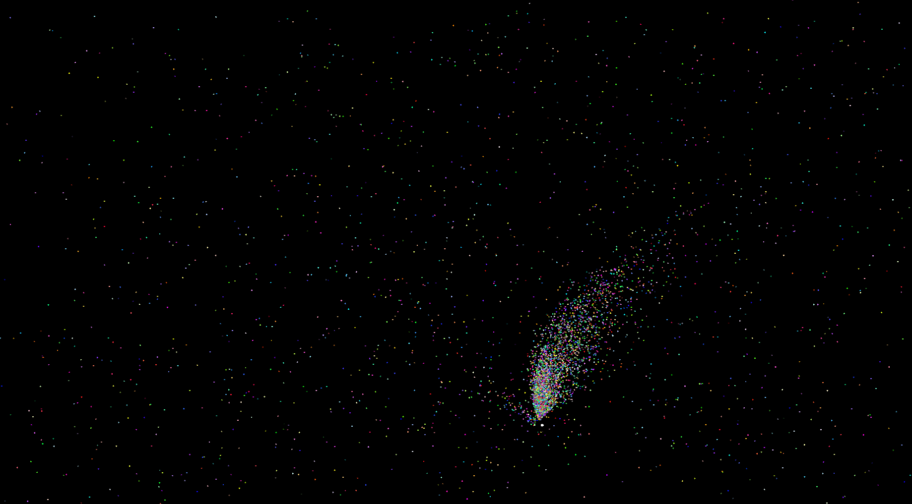
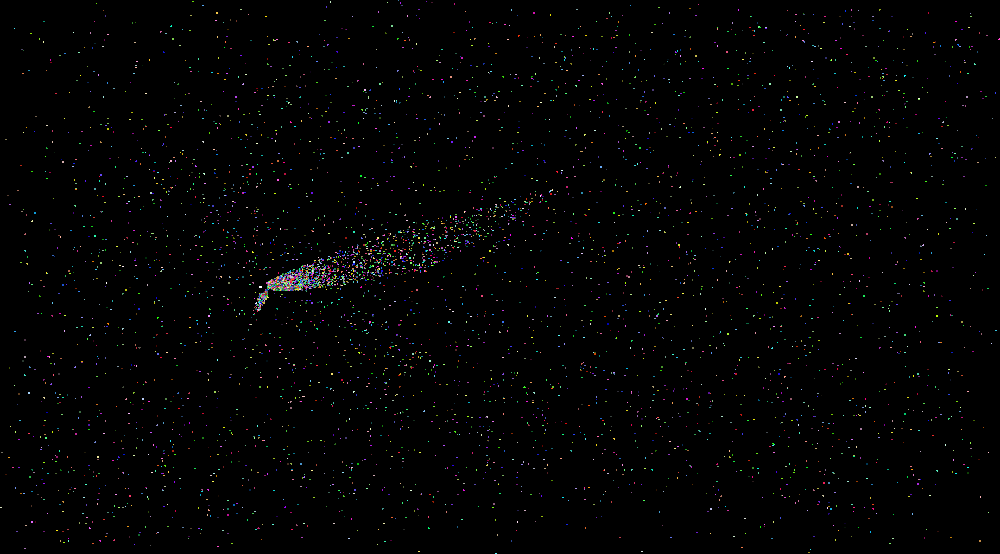

# Run

- install SFML
instead of writing a lengthly command for compiling using all libraries, run these shell scripts ; )
for radial distribution:
- bash rad.sh
for rectangular distribution:
- bash rect.sh

Not for windows or mac....ha ha ha

# Play with it
- run the scripts
- click at various points on screen to form patterns

Now, some ScreenShots to attract audience

